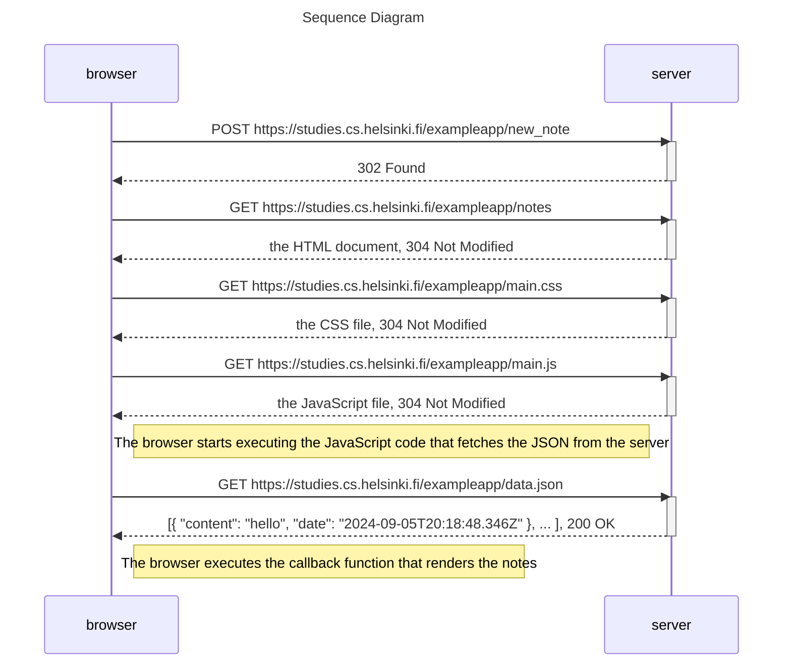

## 0.4 - uusi muistiinpano, Sequence Diagram

```mermaid
---
title: Sequence Diagram
---
sequenceDiagram
    participant browser
    participant server
    
    browser->>server: POST https://studies.cs.helsinki.fi/exampleapp/new_note
    activate server
    server-->>browser: 302 Found
    deactivate server
    
    browser->>server: GET https://studies.cs.helsinki.fi/exampleapp/notes
    activate server
    server-->>browser: the HTML document, 304 Not Modified
    deactivate server

    browser->>server: GET https://studies.cs.helsinki.fi/exampleapp/main.css
    activate server
    server-->>browser: the CSS file, 304 Not Modified
    deactivate server
    
    browser->>server: GET https://studies.cs.helsinki.fi/exampleapp/main.js
    activate server
    server-->>browser: the JavaScript file, 304 Not Modified
    deactivate server
    
    Note right of browser: The browser starts executing the JavaScript code that fetches the JSON from the server
    
    browser->>server: GET https://studies.cs.helsinki.fi/exampleapp/data.json
    activate server
    server-->>browser: [{ "content": "hello", "date": "2024-09-05T20:18:48.346Z" }, ... ], 200 OK
    deactivate server    

    Note right of browser: The browser executes the callback function that renders the notes 
```