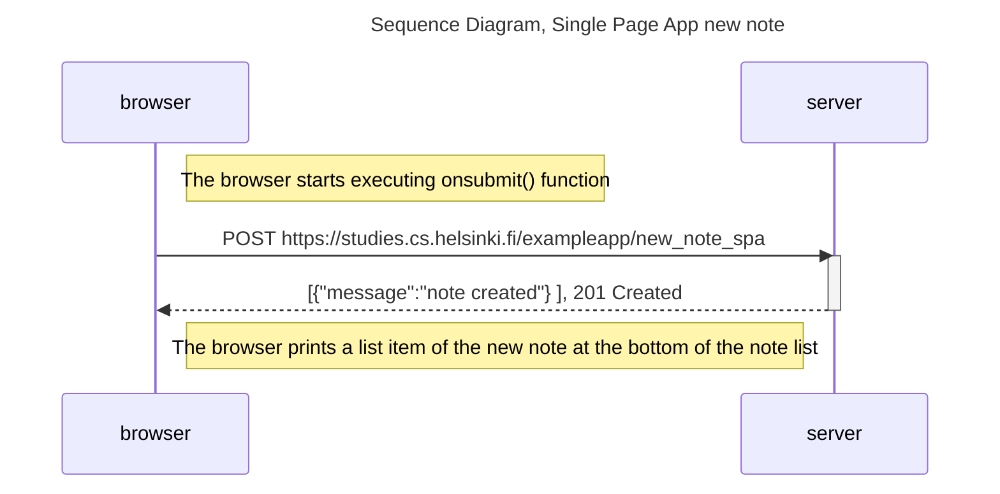

## 0.6 Uusi muistiinpano, Sequence Diagram

```mermaid
---
title: Sequence Diagram, Single Page App new note
---
sequenceDiagram
    participant browser
    participant server
    
	Note right of browser: The browser starts executing onsubmit() function 
	
    browser->>server: POST https://studies.cs.helsinki.fi/exampleapp/new_note_spa
    activate server
    server-->>browser: [{"message":"note created"} ], 201 Created
    deactivate server
	
	Note right of browser: The browser prints a list item of the new note at the bottom of the note list
```